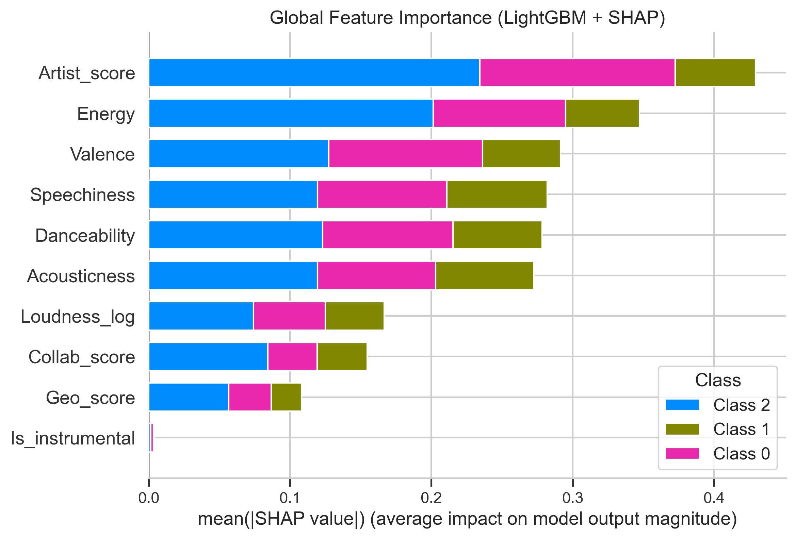
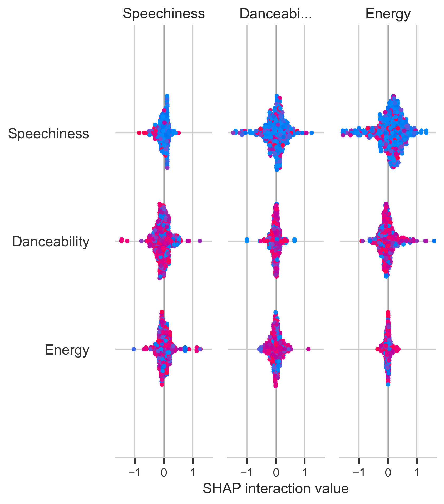
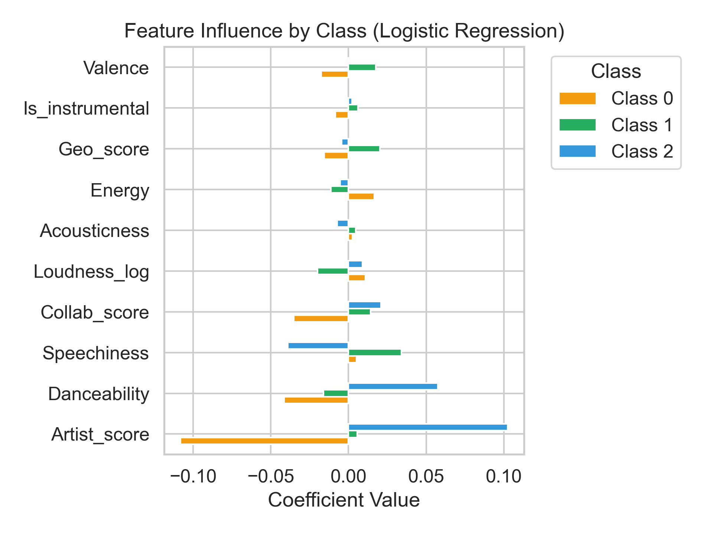

# Understanding Drivers of Music Popularity

**Interpretable machine learning analysis of Spotify Top 200 songs**

This repository is a **portfolio summary of a group project** completed for *Applied Machine Learning* at the University of Edinburgh. The project investigated which audio and artist-related features are associated with popularity tiers in Spotify's daily global Top 200 charts.

> **Portfolio note:** This public version intentionally does not include the original coursework notebook, submitted implementation, trained model files, or dataset. It focuses on the project's methodology, aggregate results, and selected visual outputs.

## Project Overview

The study used Spotify daily global Top 200 chart data from **1 January 2017 to 31 May 2023**. After preprocessing, the analysis contained **651,936 observations** and 11 modelling variables.

Song ranks were converted into three popularity tiers:

- **Class 2 — Top tier:** ranks 1–66
- **Class 1 — Mid tier:** ranks 67–133
- **Class 0 — Bottom tier:** ranks 134–200

The workflow covered data preprocessing, feature engineering, dimensionality reduction, model comparison, and explainability analysis.

## Machine Learning Workflow

### Data preparation & feature engineering

Audio and artist information was transformed into modelling features including:

- Danceability, Energy, Speechiness, Acousticness and Valence
- Artist prominence score
- Collaboration indicators
- Geographic popularity indicators
- Log-transformed Loudness
- Instrumental indicator

Correlated collaboration and geographic variables were reduced using **PCA**, producing `Collab_score` and `Geo_score`.

### Models evaluated

Five supervised classifiers were compared:

1. Logistic Regression
2. Decision Tree
3. Random Forest
4. XGBoost
5. LightGBM

Because the popularity classes were slightly imbalanced, **Macro-F1** and accuracy were used to compare model performance.

## Results

| Model | Accuracy | Macro-F1 |
|---|---:|---:|
| Logistic Regression | 0.37 | 0.36 |
| Decision Tree | 0.42 | 0.39 |
| Random Forest | 0.51 | 0.49 |
| XGBoost | 0.58 | 0.58 |
| **LightGBM** | **0.59** | **0.59** |

LightGBM achieved the strongest overall performance among the evaluated models, while Logistic Regression was retained as an interpretable linear reference.

## Explainability

### SHAP feature importance

The SHAP analysis identified **Artist_score** as the strongest predictor, followed by features including **Energy, Speechiness, Valence, and Danceability**.

### SHAP summary

The analysis suggested that artist prominence was strongly associated with high-popularity predictions, while energetic and rhythm-oriented audio characteristics also contributed to the model's decisions.

### Logistic Regression coefficients

Logistic Regression provided a complementary view of the directional relationship between features and predicted popularity tiers.

## Business Interpretation

The project connected model findings to potential streaming-platform decisions. In particular, the analysis highlighted artist prominence and selected audio characteristics as useful signals when considering content promotion and resource allocation.

These findings should be interpreted as predictive associations within the analysed chart data rather than causal effects on song popularity.

## My Contribution

This was a **four-person group project**. The original project report records separate contributions across data cleaning and preprocessing, EDA, PCA, feature engineering, model selection and training, SHAP analysis, result interpretation, and report writing.

To avoid overstating individual ownership, this public portfolio does not attribute specific components to me beyond what can be verified from the original contribution statement. I can provide a precise personal-contribution summary once my student ID is mapped to that statement.

## Repository Scope

This repository is intentionally a **portfolio reconstruction**, not a public release of the original assessed submission.

Not included:

- Original coursework notebook or submitted source code
- Spotify dataset files or processed copies
- Serialized trained models (`.pkl`)
- Coursework instructions or assessment materials

Included:

- Project methodology and findings
- Aggregate model-performance results
- Selected visual outputs from the group project

## Technologies

**Python · pandas · scikit-learn · LightGBM · XGBoost · SHAP · PCA · Data Visualization**

## Academic Context

Applied Machine Learning group project, University of Edinburgh, 2025.
